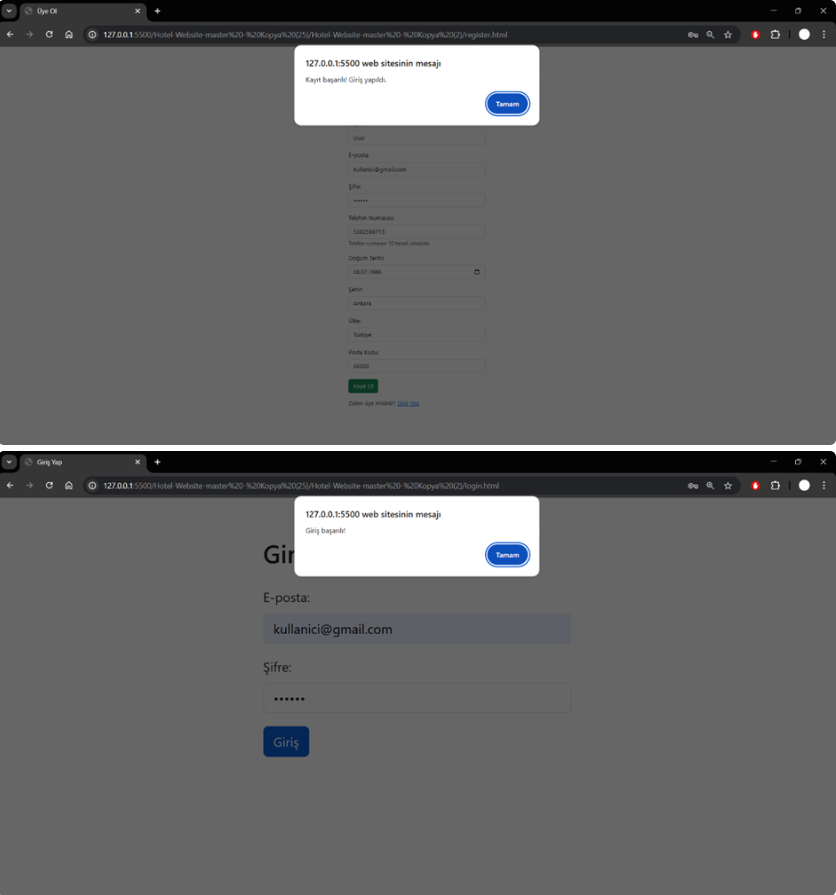
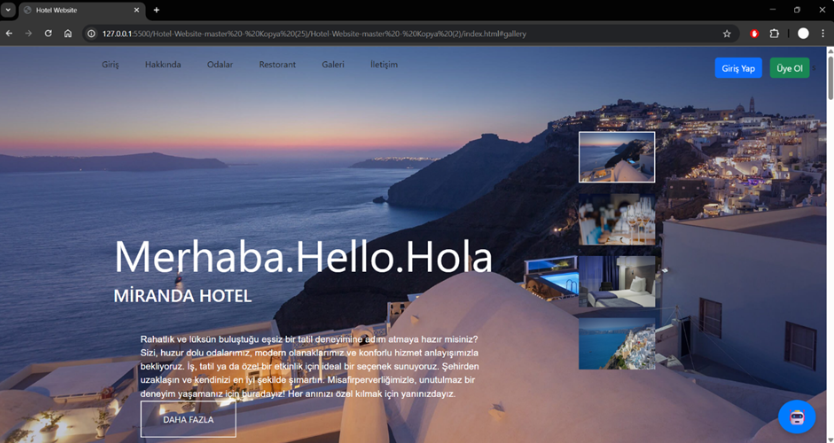
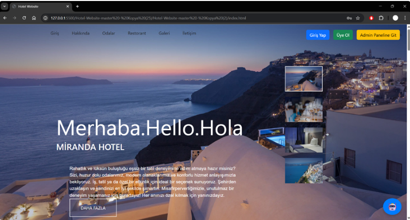
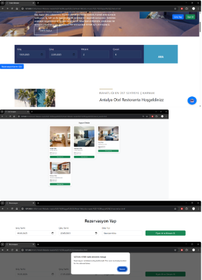
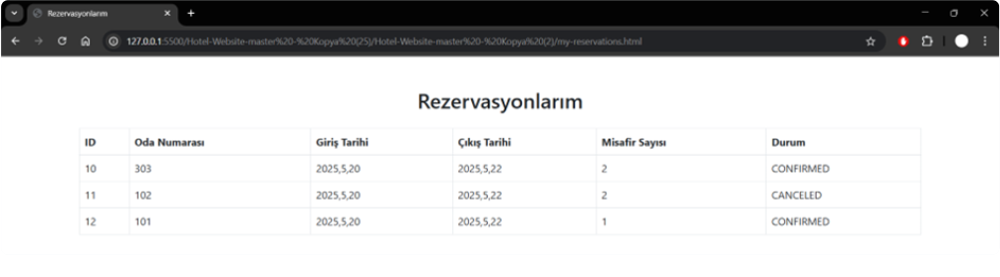
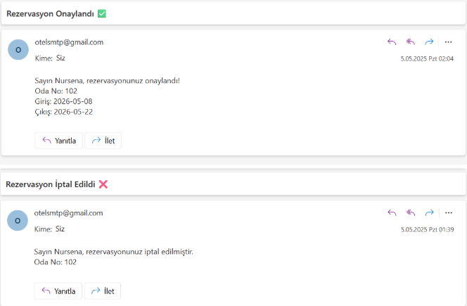
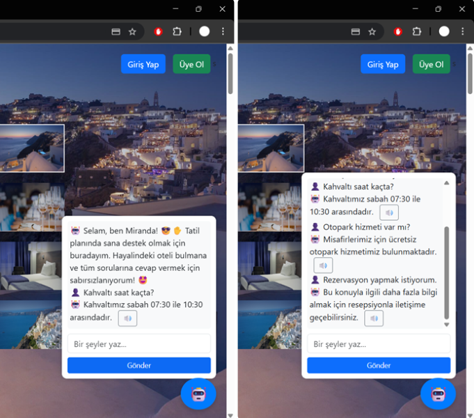
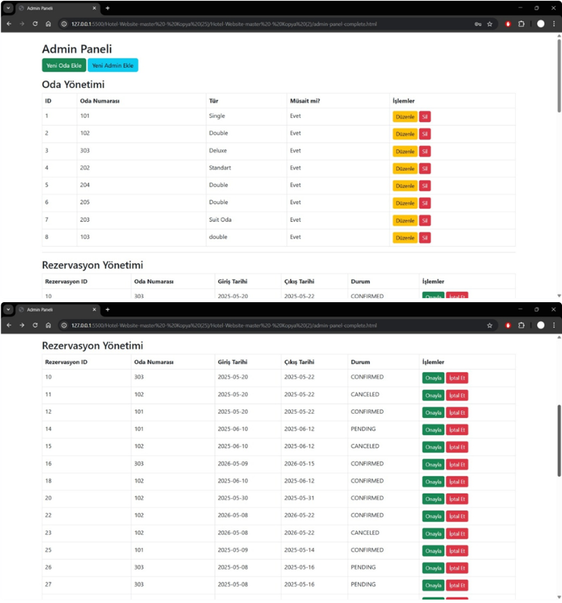
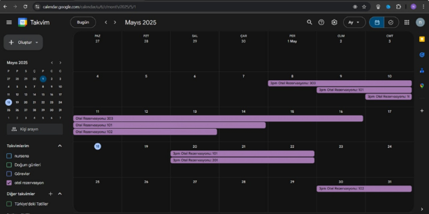

# Hotel Chatbot & Reservation Management System

> 🇹🇷 Spring Boot tabanlı, yapay zekâ destekli otel rezervasyon ve müşteri destek sistemi. Proje; kullanıcı rezervasyon akışı, chatbot asistanı, admin paneli, e-posta bildirimleri ve Google Calendar entegrasyonunu tek bir sistemde birleştirir.

A hotel reservation and customer support system that combines reservation management, AI-powered chatbot assistance, role-based authentication, email notifications and Google Calendar integration.

---

## Project Overview

This project was developed as a hotel reservation and customer support platform. The system allows users to create reservations, view reservation history and interact with an AI-supported chatbot for hotel-related questions.

The project also includes an admin panel where administrators can manage rooms and reservations. In addition, reservation processes are supported with email notifications and Google Calendar integration.

The chatbot assistant is designed to understand user questions about hotel services such as reservations, breakfast, pool availability and room information. It combines Dialogflow-based intent detection with OpenAI GPT-3.5 integration to provide more flexible responses.

---

## Project Highlights

- Hotel room reservation management
- AI-powered customer support chatbot
- Dialogflow intent detection
- OpenAI GPT-3.5 integration
- Google Cloud Speech-to-Text support
- Google Cloud Text-to-Speech support
- JWT-based authentication
- Role-based authorization for user and admin roles
- Admin panel for room and reservation management
- MySQL database integration
- SMTP-based email notifications
- Google Calendar API integration
- Reservation history tracking
- RESTful API structure with Spring Boot

---

## Main Features

### User Authentication

The system includes user login and registration flows. JWT-based authentication is used to manage secure access, while role-based authorization separates user and admin operations.

### Reservation Management

Users can create reservations by selecting reservation details such as date, room type and guest information. They can also view their reservation history through the user interface.

### AI Chatbot Assistant

The chatbot assistant helps users with hotel-related questions and reservation support.

The assistant supports:

- Hotel service questions
- Reservation-related questions
- Breakfast, pool and facility information
- More flexible responses through OpenAI GPT-3.5 integration
- Voice input with Google Cloud Speech-to-Text
- Voice output with Google Cloud Text-to-Speech

### Admin Panel

Administrators can manage hotel rooms and reservations through the admin panel.

Admin features include:

- Adding new rooms
- Editing existing rooms
- Managing reservation records
- Approving or rejecting reservation requests
- Viewing reservation status

### Email Notifications

The system sends email notifications for reservation-related events.

Notification examples include:

- Reservation created
- Reservation approved
- Reservation rejected

### Google Calendar Integration

Reservation information can be integrated with Google Calendar, allowing hotel reservation schedules to be viewed and tracked through calendar events.

---

## Technologies Used

| Technology | Purpose |
|---|---|
| Spring Boot | Backend development |
| Spring Security / JWT | Authentication and authorization |
| MySQL | Relational database management |
| Dialogflow | Chatbot intent detection |
| OpenAI GPT-3.5 | Flexible AI-powered responses |
| Google Cloud Speech-to-Text | Voice input processing |
| Google Cloud Text-to-Speech | Voice response generation |
| SMTP | Email notification system |
| Google Calendar API | Calendar integration |
| Swagger / OpenAPI | API documentation |
| Ngrok | Local webhook testing |

---

## Screenshots

| Register & Login | User Home | Admin Home |
|---|---|---|
|  |  |  |

| Reservation Creation | Reservation History | Email Notifications |
|---|---|---|
|  |  |  |

| AI Chatbot | Admin Room Management | Google Calendar Integration |
|---|---|---|
|  |  |  |

> Screenshots were captured using demo data.

---

## Suggested Screenshot Files

To make the README display correctly, upload screenshots with the following file names under:

```text
docs/screenshots/
